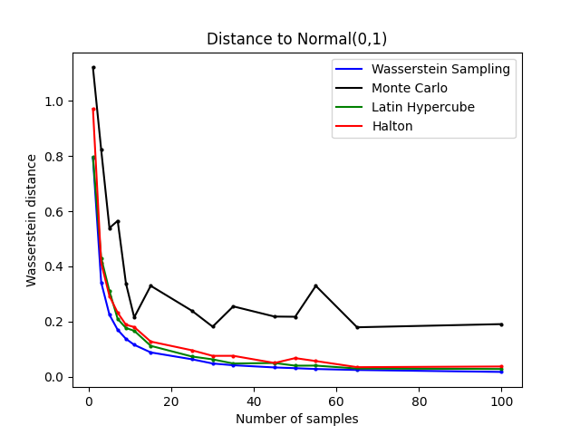

# Wasserstein Sampling

Exploratory code for constructing sample sets that minimize Wasserstein distance to a target distribution, and comparing them against Monte Carlo, Latin Hypercube, and Halton sampling.



**Quickstart**
1. Create a virtual environment: `python -m venv .venv`
2. Activate it: `source .venv/bin/activate` (macOS/Linux) or `.\.venv\Scripts\activate` (Windows)
3. Install dependencies: `pip install -r requirements.txt`
4. Run the optimizer: `python wasserstein_sampling.py`

**Repository Layout**
- `wasserstein_sampling.py` Optimizes sample locations and writes `data-new.json`.
- `patcher.py` Generates comparison plots for Monte Carlo, Latin Hypercube, and Halton sampling.
- `areametric/` Area-metric utilities used by the notebooks.
- `*.ipynb` Research notebooks.
- `data.json` and `data-total.json` Saved sample sets used in plots.
- `fig/` Notebook output figures.
- `wass-vs-others.png` Reference plot shown above.

**Mathematical Rationale**

The goal is to choose `n` sample points that make the empirical distribution as close as possible to a target distribution in the Wasserstein-1 sense. In one dimension, the Wasserstein-1 distance between distributions `F` and `G` has the quantile form:

```
W1(F, G) = ∫_0^1 |F^{-1}(u) - G^{-1}(u)| du
```

The code optimizes `n` points in `[0, 1]` that define an empirical CDF `F_n`. By minimizing the integral of the absolute difference between the uniform quantile function and the empirical quantile function of these points, it finds the best placement of quantiles for a given `n`. Those optimized uniform quantiles are then mapped into the target distribution (here, `Normal(0,1)`) via the inverse CDF, yielding samples that are Wasserstein-optimal for that sample size.

**Notes**
- `wasserstein_sampling.py` writes `data-new.json` in the repo root.
- `patcher.py` writes `wass-vs-mc.png` in the repo root.

**License**
GPL-3.0. See `LICENSE`.
